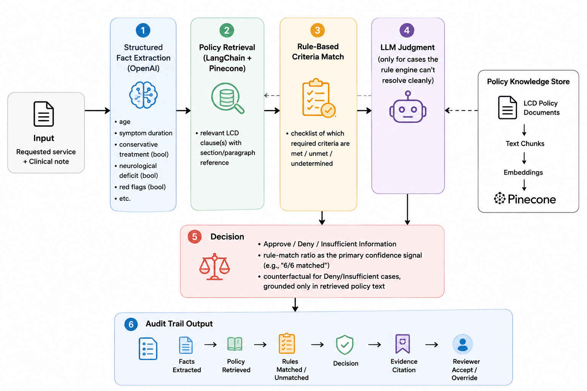
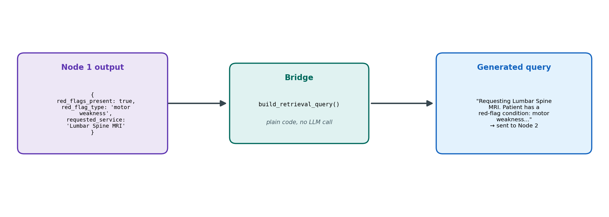
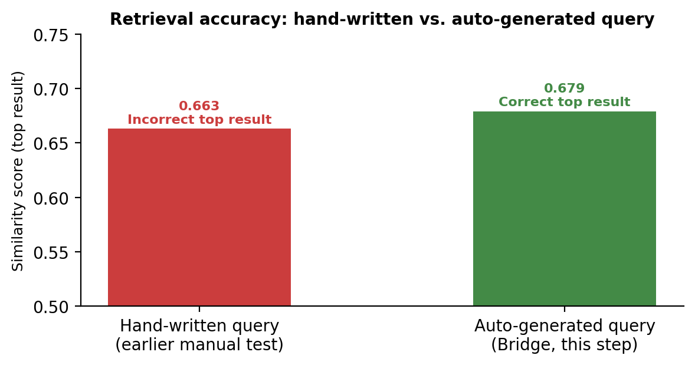
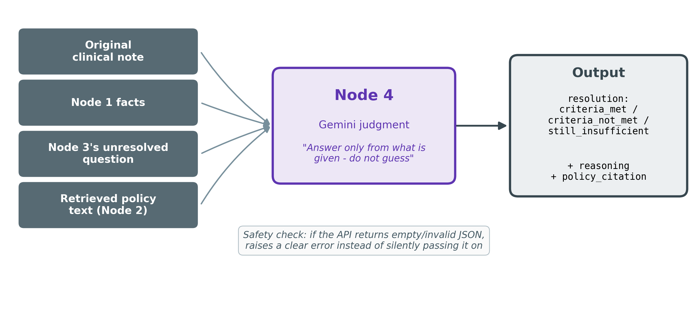
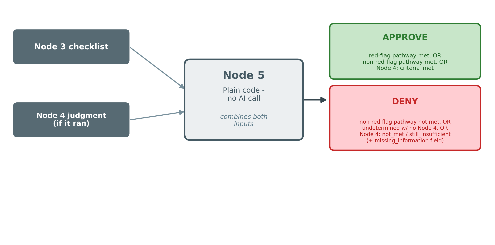

# Agentic System for Medicare Coverage Eligibility Review

Healthcare reviewers spend significant time manually determining whether a patient's clinical documentation satisfies Medicare coverage requirements for a requested medical service. Although CMS publishes Local Coverage Determinations (LCDs) through the Medicare Coverage Database, reviewers must read lengthy clinical notes, extract the relevant clinical information, evaluate it against Medicare coverage criteria, determine whether the requested service meets those criteria, and document the rationale for their decision.

This project automates that first-pass coverage eligibility review using an agentic Retrieval-Augmented Generation (RAG) workflow. Given a clinical note and a requested procedure (starting with Lumbar MRI), the system:

* Extracts structured clinical facts from unstructured documentation,
* Retrieves the relevant CMS Local Coverage Determination (LCD),
* Evaluates the extracted facts against documented coverage criteria using deterministic rules,
* Invokes an LLM only when additional clinical reasoning is required,
* Returns an Approve, Deny, or Insufficient Information recommendation,
* Provides policy citations and an auditable reasoning trail for human review.

## Business goal
The system serves as a clinical decision-support assistant by Reducing the manual effort required to evaluate Medicare coverage eligibility by automating the first-pass comparison between clinical documentation and CMS coverage criteria while preserving human oversight and full decision traceability.


## Scope for this build: 

**lumbar spine MRI requests**, evaluated against the real CMS Local Coverage Determination for lumbar MRI (L34220).

## Architecture




## Technologies

| Layer | Tool | Purpose |
|---|---|---|
| Orchestration | LangGraph | Multi-step agent workflow across the nodes above |
| Retrieval | LangChain + Pinecone | Chunk, embed, and retrieve policy documents |
| LLM | OpenAI | Structured fact extraction and clinical judgment |
| Evaluation | RAGAS | Retrieval quality and decision-accuracy scoring against labeled scenarios |
| Experiment tracking | MLflow | Logging retrieval experiments and prompt variants (not model training) |
| API | FastAPI | Serves the pipeline as a web service |
| Containerization | Docker | Packages the FastAPI service |
| Deployment | AWS ECS | Hosts the containerized app |
| CI/CD | GitHub Actions | Lint/test on PR, build + push image, deploy on merge |

## Data sources

- **Clinical notes (real):** `AGBonnet/augmented-clinical-notes` (Hugging
  Face) — case narratives sourced from PMC-Patients, real doctor-written
  case presentations from open-access PubMed Central case studies.
- **Coverage policy (real):** CMS Local Coverage Determination L34220
  (Lumbar MRI) — a U.S. government work, public domain.
- **Ground-truth labels:** hand-labeled prior-auth scenarios, built by
  pairing a note + requested service + decision + rationale against the
  actual criteria in L34220.

## Evaluation

The labeled scenario set serves as ground truth for:
- Retrieval quality (did the system pull the correct policy clause)
- Decision accuracy (does the output match the expected Approve/Deny/
  Insufficient Information label)
- Citation correctness (is the cited clause the one that actually
  justifies the decision)
- Missing-information detection (does the system correctly flag
  Insufficient Information rather than guessing)

  # Build Log: Step-by-Step Development Process

This document records exactly how this project was built, in the order
it was built, so the process can be reproduced from scratch. Each phase
includes the goal, the concrete steps taken (accounts, installs,
commands), what was produced, and why each decision was made.

---

## Phase 0: Environment Setup

**Goal:** A working environment with access to an LLM, an embedding
model, and a vector database.

**Steps:**
1. Chose Google Colab as the development environment (free GPU/runtime
   access, no local setup required).
2. Created accounts and generated API keys for three services:
   - **Pinecone** (pinecone.io) - sign up, navigate to API Keys, copy the
     default key.
   - **Voyage AI** (voyageai.com) - sign up, navigate to API Keys,
     generate a new key.
   - **Google AI Studio** (aistudio.google.com) - sign up, click "Get API
     key," create a key (used for Gemini).
3. Stored all three keys in Colab's built-in Secrets manager (key icon
   in the left sidebar) rather than hardcoding them in notebook cells:
   `PINECONE_API_KEY`, `VOYAGE_API_KEY`, `GOOGLE_API_KEY`.
4. Installed required packages:
   ```
   pip install google-genai voyageai pinecone
   ```
   (Note: the Pinecone Python package was renamed from `pinecone-client`
   to `pinecone` during development - the install command above reflects
   the current correct name.)

**Why Colab Secrets over hardcoding:** keeps credentials out of notebook
files that might be shared or committed to version control.

---

## Phase 1: Data Acquisition

**Goal:** Real clinical notes and a real coverage policy document to
build and test against - no synthetic/fabricated data.

**Steps:**
1. **Clinical notes:** Identified `AGBonnet/augmented-clinical-notes` on
   Hugging Face - real case narratives derived from PMC-Patients
   (published, open-access PubMed Central case studies).
2. Downloaded the dataset (this step requires an environment with
   internet access to huggingface.co):
   ```python
   from datasets import load_dataset
   ds = load_dataset("AGBonnet/augmented-clinical-notes", split="train")
   df = ds.to_pandas()
   ```
3. Filtered the ~30,000-row dataset down to a back-pain/musculoskeletal
   subset (~3,600 rows) using a keyword filter on the note text, since
   the project's initial policy scope is lumbar MRI.
4. Saved both the full dataset and the filtered subset to Google Drive
   (`full_notes.jsonl`, `back_pain_subset.jsonl`) so they persist across
   Colab sessions.
5. **Coverage policy:** Retrieved the real, current text of CMS Local Coverage Determination L34220 (Lumbar MRI) from the Medicare Coverage Database (cms.gov). This document defines the specific criteria a lumbar MRI request must meet to be covered — including a list of "red-flag" conditions (e.g., major trauma, cancer history, motor weakness) that qualify a request immediately, and a separate rule for cases without a red flag requiring at least 4 weeks of documented, failed conservative treatment. Copied the relevant sections into a plain text file, preserving the original section structure (Red Flag Conditions, Non-Red-Flag Criteria, Documentation Requirements, etc.), since that structure was later used directly for chunking in Phase 3. Saved as a clean text file in `data/policy_docs/L34220_lumbar_mri.txt`.

---

## Phase 2: Ground-Truth Scenario Set

**Goal:** A small set of real patient cases with a manually-determined
correct answer, to evaluate the system against later.

**Steps:**
1. Sampled candidate notes from the 3,614-note back-pain subset using
   pandas' `.sample(n=15, random_state=42)` - a fixed seed so the same
   batch could be re-pulled and reviewed consistently.
2. Manually read each sampled note and checked it against L34220's
   actual criteria.

Executed the below code in the same Colab notebook against (`back_pain_subset.json `) used for data fetching (Phase 1), in a new cell after the dataset had already been filtered and saved.

  ```python
   import pandas as pd
import json, os

subset_path = os.path.join(DRIVE_FOLDER, "back_pain_subset.jsonl")
relevant = pd.read_json(subset_path, lines=True)

sample = relevant.sample(n=15, random_state=42)

for _, row in sample.iterrows():
    print(f"--- idx: {row['idx']} ---")
    print(row['full_note'][:500])
    print()
```
| Note | Disposition | Reason |
|---|---|---|
| idx 206186 (blurry vision, headache) | Discarded | False-positive keyword match - no back-pain complaint |
| idx 154031 (orbital cellulitis) | Discarded | False-positive keyword match |
| idx 193494 (abdominal mass) | Discarded | "Lumbar" used as anatomical exam location, not a complaint |
| idx 52554 (lipodystrophy) | Discarded | False-positive keyword match |
| idx 93906 (dyspnea/cough) | Discarded | False-positive keyword match |
| idx 167591 (cyclist leg injury) | Discarded | False-positive keyword match |
| idx 153664 (shoulder) | Discarded | False-positive keyword match |
| idx 145908 (myelopathy) | Discarded | Ambiguous - thoracic-level, not clearly "back pain" |
| idx 49098 (bilateral numbness) | Discarded | Ambiguous - unclear presentation |
| idx 131774, 175175, 31829, 61287 | Kept aside | Genuine hip/knee/neck cases - outside L34220's lumbar-only scope, usable if expanding to other procedures later |
| idx 89665, 133792, 155216, 19968, 133948 | Hand-labeled | Genuine lumbar-relevant cases meeting review criteria |

**Hand-labeled scenarios:**

| Note | Requested Service | Red Flag? | Conservative Tx Documented? | Expected Decision |
|---|---|---|---|---|
| 89665 | Lumbar Spine MRI | No | No | Deny |
| 133792 | Lumbar Spine MRI | Yes (motor weakness) | Not documented | Approve |
| 155216 | Lumbar & Cervical MRI | Yes (neuro/motor deficit) | Not documented | Approve |
| 19968 | Lumbar Spine MRI | Yes (multiple: trauma, motor, sensory, bladder/bowel) | Not documented | Approve |
| 133948 | Hip MRI | No | Not documented | Off-scope (no lumbar policy match) |

Built a small script (`build_scenarios.py`) that stores these labeled
scenarios as a structured list of dictionaries with a consistent schema,
making it straightforward to add more labeled scenarios later without
redesigning the format.


---
## Phase 3: Node 1 - Structured Fact Extraction

**Goal:** Convert a raw clinical note into a fixed set of structured
facts needed to evaluate coverage criteria.

**Steps:**

1. Defined a JSON schema listing exactly which fields to extract:

   | Field | Type | Notes |
   |---|---|---|
   | `age` | integer, nullable | Null if not stated |
   | `symptom_duration` | string, nullable | As stated in the note (e.g. "6 months") |
   | `conservative_treatment_documented` | boolean, nullable | True/False/Null - null means not mentioned either way |
   | `neurological_deficit` | boolean | Required field |
   | `neurological_deficit_detail` | string, nullable | Brief description if present |
   | `red_flags_present` | boolean | Required field |
   | `red_flag_type` | string, nullable | Which red flag(s), if any |
   | `requested_service` | string | Required field |

2. **Model used:** the reasoning/extraction model changed twice before
   settling:

   | Stage | Model | Reason for change |
   |---|---|---|
   | Original plan | OpenAI | Initial project scope |
   | First switch | Claude Sonnet | Reconsidered vendor choice |
   | Final | Gemini (`gemini-3.6-flash`) | Two-vendor stack (Gemini + Voyage AI) instead of three separate providers |

3. Built the extraction function using Gemini's schema-constrained
   structured output, so the response is always valid JSON in the exact
   shape above:
```python
   def extract_facts(clinical_note, requested_service):
       prompt = (
           f"Requested service: {requested_service}\n\n"
           f"Clinical note:\n{clinical_note}\n\n"
           "Extract the structured clinical facts from this note. Only use "
           "information actually stated or clearly implied in the note - do "
           "not guess or infer beyond what's written."
       )
       response = client.models.generate_content(
           model="gemini-3.6-flash",
           contents=prompt,
           config=types.GenerateContentConfig(
               response_mime_type="application/json",
               response_schema=extraction_schema
           )
       )
       return json.loads(response.text)
```

4. **Validated** against the 5 labeled scenarios from Phase 2:

   | Note | Age extracted | Duration extracted | Red flag detected | Correct? |
   |---|---|---|---|---|
   | 89665 | 47 | null (correctly - not stated) | No | Yes |
   | 133792 | 70 | 6 months | Yes - motor weakness | Yes |
   | 155216 | 16 | null | Yes - neuro/motor deficit | Yes |
   | 19968 | 46 | 2 hours | Yes - major trauma, motor, sensory, bladder/bowel | Yes |
   | 133948 | 36 | 2 months | No | Yes |

   Fields the note didn't mention were correctly returned as `null`
   rather than guessed.
## Phase 4: Node 2 - Policy Retrieval

**Goal:** Given a natural-language question, retrieve the correct
section of the L34220 policy text.

**Steps:**

1. Split the L34220 text into sections. First attempt used a regex to
   detect ALL-CAPS section headers. This produced only 5 chunks and
   silently merged two critical sections into others, because their
   titles contain a lowercase parenthetical immediately after the caps
   (e.g., "RED FLAG CONDITIONS (any one of the following...)").

   | Chunking attempt | Chunk count | Result |
   |---|---|---|
   | Regex (ALL-CAPS header detection) | 5 | "Red Flag Conditions" and "Non-Red-Flag Criteria" merged into "Coverage Indications" - not independently searchable |
   | Manual (exact section boundaries hardcoded) | 8 | All 8 sections independently searchable, including both merged ones |

   **Fix:** manually defined each section's exact text boundaries in
   code instead of relying on pattern detection, since the source
   document is small and fully known.

2. **Executed in:** the same Colab notebook, in a new cell after the
   policy text was loaded as a Python string.

   **Code (final, correct version):**
```python
   chunks = [
       {"section": "Preamble", "text": "..."},
       {"section": "Coverage Indications, Limitations, and/or Medical Necessity", "text": "..."},
       {"section": "Red Flag Conditions", "text": "..."},
       {"section": "Non-Red-Flag Criteria", "text": "..."},
       {"section": "Not Covered / Investigational Uses", "text": "..."},
       {"section": "Duplication of Studies", "text": "..."},
       {"section": "Documentation Requirements", "text": "..."},
       {"section": "Utilization Guidelines", "text": "..."},
   ]
```

3. Embedded each of the 8 chunks using Voyage AI:
```python
   result = vo.embed(chunk_texts, model="voyage-3-large", input_type="document")
```
   Produced 8 embeddings, dimension 1024.

4. Created a Pinecone index and upserted the embedded chunks:
```python
   pc.create_index(name="prior-auth-policy", dimension=1024, metric="cosine",
                    spec=ServerlessSpec(cloud="aws", region="us-east-1"))
   index.upsert(vectors=vectors_to_upsert)
```
   Each vector's metadata includes its section name and full text, so
   retrieval returns readable results, not just IDs.

5. Wrote `retrieve_policy(query, top_k)`: embeds the query with
   `input_type="query"` (Voyage's separate mode for search queries vs.
   stored documents) and returns Pinecone's closest matches.

6. **Validated** with the test query: *"Patient has significant motor
   weakness and neurological deficit in the leg. Is a lumbar MRI covered
   without conservative treatment first?"*

   | Chunking version | Top result | Correct? |
   |---|---|---|
   | 5-chunk (buggy) | Preamble (0.663), Utilization Guidelines (0.546) | No - Red Flag Conditions did not appear in top 2 |
   | 8-chunk (fixed) | Red Flag Conditions (0.679) | Yes |
**Why manual chunking instead of an automated splitter:** for a small,
fixed source document, manually verifying chunk boundaries is more
reliable than a general-purpose splitting heuristic, and the earlier bug
demonstrated exactly how a heuristic can silently fail in a way that's
hard to notice until retrieval quality is tested.

**Reference:** `src/node2_retrieval.py`

---

## Phase 5: Bridge (Node 1 to Node 2)

**Background:** Node 1 produces structured facts; Node 2
expects a text question. Something needs to connect the two
automatically, or a person would have to hand-write a search query for
every patient.

**Goal:** Automatically generate Node 2's search query from Node 1's
extracted facts, so no one has to hand-write a query per patient.

**Steps:**

1. Wrote a plain-code function (no LLM call) that assembles a search
   query directly from the structured facts dictionary Node 1 returns -
   translating each fact (red flag present, symptom duration,
   conservative treatment status) into a corresponding sentence, then
   joining them into one query string.

<p align="center">
  
</p>

2. Wrapped Node 1, the query builder, and Node 2's retrieval into a
   single function so the full chain runs in one call, returning the
   extracted facts, the generated query, and the retrieved policy
   matches together.

3. **Validated** on note idx 133792 (the red-flag case):

<p align="center">
  
</p>

   The auto-generated query outperformed an earlier hand-written test
   query - likely because it states the red flag explicitly rather than
   describing symptoms more loosely.

**Implementation:** `src/node2_retrieval.py`
(`build_retrieval_query`, `extract_and_retrieve`)

---

## Phase 6: Node 3 - Rule-Based Criteria Match

**Background:** By this point, Node 1 has read the clinical note and
produced a clean list of facts, and Node 2 has retrieved the relevant
policy text. But nothing has actually *compared* the two yet - the
system knows the facts, and it knows the rule, but hasn't checked
whether the facts satisfy the rule. That comparison is a straightforward
yes/no lookup for most cases (e.g., "is red_flags_present true?"), which
doesn't require an AI model to answer - it just requires checking a
value against a condition, the same way a spreadsheet formula would.
Node 3 does that comparison directly in code, reserving the more
expensive, slower LLM call (Node 4) only for the cases where the facts
alone genuinely aren't enough to decide.

**Goal:** Check the extracted facts directly against L34220's two
coverage pathways, resolving clear cases without any LLM call.

**Steps:**

1. Implemented the **red-flag pathway** check: a direct read of
   `red_flags_present` from Node 1's output. If true, the case is
   resolved immediately - no further checks needed.

2. Implemented the **non-red-flag pathway** check: requires both (a)
   symptom duration >= 4 weeks and (b) documented conservative treatment.
   Wrote a duration parser converting free-text durations ("6 months",
   "2 weeks") into a comparable number of weeks.

3. If either required value can't be determined (unparseable duration,
   or conservative treatment not documented either way), the case is
   flagged `needs_llm_judgment: True` with a specific reason - rather
   than defaulting to an assumption

4. **Validated** against two known cases:

   | Note | Red flag? | Duration | Conservative tx | Result |
   |---|---|---|---|---|
   | 133792 | Yes (motor weakness) | 6 months | Not documented | `red_flag_pathway: MET` - resolved without needing Node 4, even though the non-red-flag pathway alone was ambiguous |
   | 89665 | No | Not stated | Not documented | `needs_llm_judgment: True` - correctly flagged rather than guessed |

   
**Reference:** `src/node3_rules.py`

---

## Phase 7: Node 4 - LLM Judgment (conditional)

**Phase 7 - Background:** Node 3 resolves most cases on its own, but
some notes genuinely don't contain enough clearly-structured information
for a simple yes/no check. This step exists to handle exactly those
remaining cases, through careful reading rather than a guess.

**Goal:** Resolve the specific ambiguous point Node 3 could not, using
only the original note and the retrieved policy text - not general
knowledge.

**Steps:**

1. Defined a structured-output schema for the response: `resolution`
   (one of `criteria_met` / `criteria_not_met` / `still_insufficient`),
   `reasoning`, and `policy_citation`.

2. Built a prompt providing four inputs together, and instructing the
   model to answer only from that material:

<p align="center">
  
</p>

3. Added a safety check after observing a failure mode where the API
   occasionally returned valid-but-empty JSON (`null`) rather than a
   real answer - likely tied to transient server load. The check raises
   a clear error prompting a retry instead of silently passing along an
   empty result.

4. **Validated** on the sparse-info case (note idx 89665):

   | Field | Result |
   |---|---|
   | Resolution | `still_insufficient` |
   | Reasoning | Correctly cited the missing symptom duration and missing conservative-treatment documentation |
   | Policy citation | Non-Red-Flag Criteria |

Implementation: `src/node4_judgment.py`
---

## Phase 8: Node 5 - Final Decision

**Background:** 

By this point the system has determined whether coverage
criteria are met, either directly (Node 3) or through judgment (Node 4).
Nothing has yet combined these into one final, single answer - that's
this step's only job.

**Goal:** Combine Node 3 and Node 4's outputs into one final decision.

**Steps:**

1. Wrote plain combination logic (no LLM call) mapping the two inputs
   to a final Approve or Deny outcome:
<p align="center">
  
</p>

   | Node 3: Red-flag pathway | Node 3: Non-red-flag pathway | Node 4 ran? | Node 4 resolution | Final Decision |
   |---|---|---|---|---|
   | Met | (irrelevant) | No | - | **Approve** |
   | Not met | Met | No | - | **Approve** |
   | Not met | Not met | No | - | **Deny** |
   | Not met | Undetermined | No | - | **Deny** (+ `missing_information`) |
   | Not met | Undetermined | Yes | `criteria_met` | **Approve** |
   | Not met | Undetermined | Yes | `criteria_not_met` | **Deny** |
   | Not met | Undetermined | Yes | `still_insufficient` | **Deny** (+ `missing_information`) |

3. **Decision model changed during development:** initially a three-way
   outcome (Approve / Deny / Insufficient Information), matching the
   original project scope. Later collapsed to **two-way (Approve /
   Deny)** - cases that would have been "Insufficient Information" now
   resolve to Deny, with the missing documentation surfaced as a
   separate `missing_information` field rather than its own category.

**Implementation: `src/node5_decision.py`

---

## Phase 9: Node 6 - Audit Trail and Human Review

**Goal:** Present the full reasoning chain in a readable format, and
require a human reviewer to independently confirm the final decision.

**Steps:**
1. Wrote a formatting function assembling every prior node's output into
   one top-to-bottom summary: facts extracted, policy retrieved, rules
   matched, judgment (if used), decision.
2. Built a reviewer step using `input()`: shows the AI's recommended
   decision and reasoning as reference, then requires the reviewer to
   type their own decision and reason - the human's input is the final
   record, and the system separately tracks whether it matched the AI's
   recommendation.
3. Added a color-coded (green/red) HTML decision display for fast visual
   confirmation of the outcome, using `IPython.display.HTML`.

**Reference:** `src/node6_audit_trail.py`, `src/reviewer_action.py`,
`src/decision_display.py`

---

## Phase 10: End-to-End Validation

**Goal:** Confirm the full chain (Node 1 through Node 6) works correctly
across multiple real patient cases, not just in isolation.

**Steps:**
1. Wrote a script running all 5 labeled scenarios through the complete
   pipeline in sequence, printing each result against its expected
   outcome.
2. Validated individual end-to-end runs, including both Approve and Deny
   outcomes and a case requiring Node 4's judgment step.
3. A full batch run of all 5 in one session has not yet completed
   successfully due to hitting the Gemini API free-tier daily request
   quota partway through - a usage-limit issue, not a defect in the
   pipeline logic.

**Reference:** `src/run_all_5_scenarios.py`

## Status

This README describes the intended end-to-end architecture. Build status
and progress are tracked separately as the project develops.
